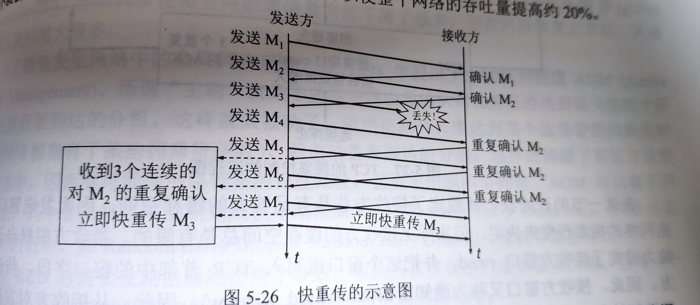
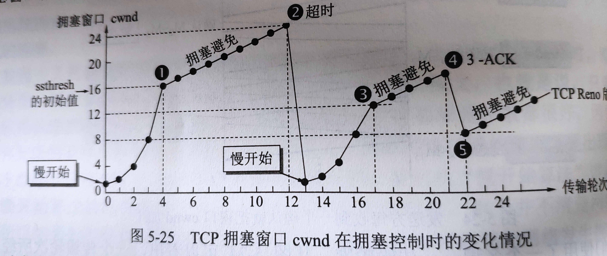

### TCP拥塞控制的原理

TCP拥塞控制有四种算法：*慢启动、拥塞避免、快速重传、快速恢复*

传输开始时，使用**慢启动**算法，发送方设置拥塞窗口（cwnd）为1，发送第一个报文段M1，发送方收到M1的确认后，将cwnd设置为2，发送第二个报文段M2，收到M2的确认后，将cwnd设置为4。每经过一个传输轮次（RTT时间），拥塞窗口就加倍。

同时设置有一个慢开始门限（ssthresh， slow start threshold），用来控制慢启动到拥塞避免算法的切换，当cwnd>ssthresh的时候，切换到**拥塞避免**算法。拥塞避免的思路是让cwnd缓慢增大，每经过一个传输轮次cwnd+1。

cwnd持续增大，当到达一定值时，网络出现超时，发送方判断为网络拥塞，则将ssthresh减半，同时设置cwnd=1，重新进入**慢启动**算法阶段。

这里有个细节，如果在判断对方网络拥塞时，对方不是超时，而是客户端连续收到了3个重复的ACK，则会启动**快速重传**算法，立即发送缺少的报文段。

此时，发送方不会重新回到慢启动阶段，而是启动**快速恢复**算法，将ssthresh设置为cwnd的一半，同时设置cwnd=ssthresh，然后开始执行拥塞避免算法。

